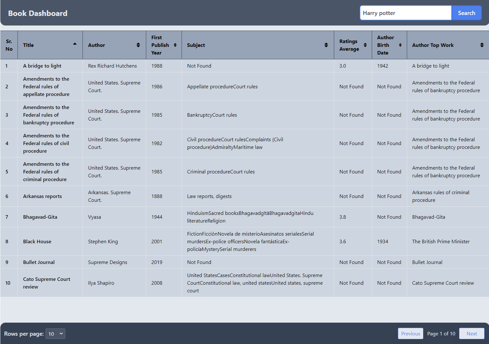

# Book Dashboard

This project is a React application that provides a dashboard to display book records fetched from the OpenLibrary API. It features search, pagination, sorting, and client-side data management to enhance user experience.

## Features

- **Search**: Search for books by title, author, or other keywords.
- **Pagination**: Navigate through pages of book records, with customizable rows per page.
- **Sorting**: Sort the book records by any column in ascending or descending order.
- **Client-Side Management**: Handles pagination, sorting, and row limit changes on the client side to reduce redundant API calls.

## Technologies Used

- **React**: JavaScript library for building user interfaces.
- **Vite**: Next Generation Frontend Tooling.
- **TailwindCSS**: A utility-first CSS framework.
- **Axios**: Promise-based HTTP client for the browser and node.js.

## Demo

Link to demo : [Click Here](https://book-dashboard-one.vercel.app/) 


## Screenshots
- **Loading Page :**


- **Table View :**




## Getting Started

### Prerequisites

Make sure you have the following installed:

- Node.js (>= 12.x)
- npm (>= 6.x)

### Installation

1. Clone the repository:

```bash
git clone https://github.com/Abhineet-K/Book_dashboard.git
```

2. Go to the project directory
 ```base
 cd book-dashboard
 ```

3. Install dependencies

```bash
  npm install
```

4. Start the server

```bash
  npm run dev
```

5. Open http://localhost:5173 to view it in your browser.


## API Reference

**Get All Books :** <br/>
`Search Endpoint:` [https://openlibrary.org/search.json?q={Book_Title}](https://openlibrary.org/search.json?q=the%20lord%20of%20the%20rings) <br/>

**Get Book's Author :** <br/>
`Author Endpoint:` [https://openlibrary.org/search/authors.json?q={Author_Name}](https://openlibrary.org/search/authors.json?q=j%20k%20rowling) <br/>


## License

This project is licensed under the MIT License. See the [LICENSE](https://choosealicense.com/licenses/mit/) file for details.